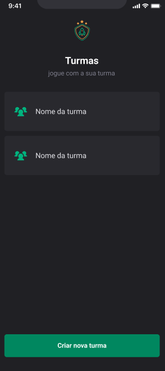
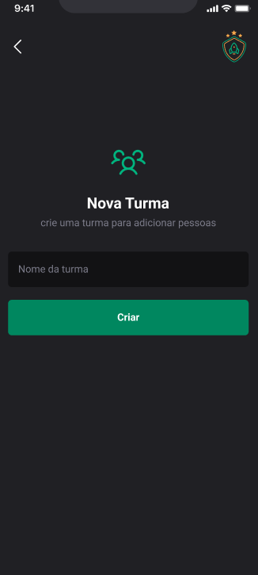
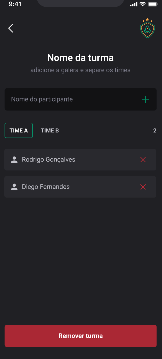

## 💻 Projeto

# Ignites Teams

[](https://github.com/linkdri1/Ignite_Teams/blob/main/LICENSE)

# Sobre o projeto
Projeto Ignite Teams. A proposta de ajudar a organizar pessoas que se reúnem para jogar em turmas. É um aplicativo com navegação em pilhas onde é possível cadastrar/remover turmas/membros do time e armazenar essas informações no armazenamento local do aparelho, preservando os dados mesmo que o app seja fechado. Seguiremos um guia de estilo para implementar nosso tema no Styled Components a fim de manter um padrão em todo o app.

 **</>Codelink**.


## Layout mobile






# Tecnologias utilizadas
## Aplicação

getting-started)
- [Expo](https://docs.expo.dev/?utm_source=google&utm_medium=cpc&utm_content=search&gclid=CjwKCAjwxOymBhAFEiwAnodBLE4O6-g49a-HniPnrQt_l-6t_CNvui4z2_h31jUCUpesirHbFYmI_hoC39IQAvD_BwE)
- [Styled components](www.google.com/url)
- [TypeScript](https://www.typescriptlang.org/docs/)
- [Google fonts](https://docs.expo.dev/develop/user-interface/fonts/#use-a-google-font)
- [Babel -plugin-module-resolver](https://github.com/tleunen/babel-plugin-module-resolver#readme)

- [Use google fonts](https://docs.expo.dev/develop/user-interface/fonts/#use-a-google-font)
-[phosphor icons](https://phosphoricons.com)
- [React Navigation](https://reactnavigation.org)
-[Image picker](https://docs.expo.dev/versions/latest/sdk/imagepicker/)
- [NPM](https://docs.npmjs.com)


# Funcionalidades do projet

- [x] Tela SignIn 
- [x] Tela SignUp
- [x] Tela Home
- [x] Tela de Treino do dia 
- [x] Tela de histórico de execícios
- [x] Perfil


# Como executar o projeto

```bash
# clonar repositório
git clone https://github.com/linkdri1/Projeto_ImHere.git

# entrar na pasta do projeto.
cd Projeto Ignite_Gym

# instalar o pacote node_modules.
npm install

# Executar o projeto
npx expo run start
```
## Aplicação Mobile
Pré-requisitos: npm 

# Autor

Rodrigo Teixeira Silva


## [Linkedin](https://www.linkedin.com/in/rodrigo-teixeira-silva/)


